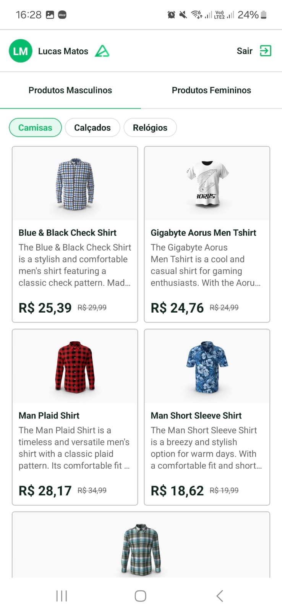
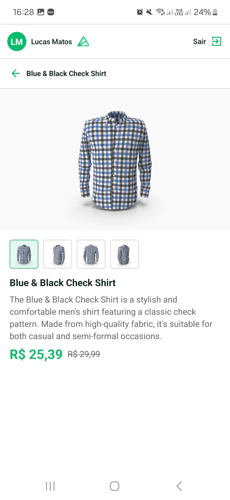

# Product Catalog Application

The project consists of creating an application using React Native (Expo) and Axios, developed by UniFecaf college. Additionally used <a href="https://tanstack.com/query"><code>@tanstack/react-query</code></a> for query manipulation and state management (e.g. loading and caching).

#### HOW TO EXECUTE

1. <strong>Install the dependencies</strong>: <code>npm install</code>
2. <strong>Run the project</strong>: <code>npm run start</code>
3. <strong>Open the project</strong>: Scan the QR code with <a href="https://expo.dev/go">Expo Go</a>.
4. <strong>Authentication</strong>: Log in using the masked credentials at <a href="./context/AuthContext/AuthContext.constants.ts">AuthContext Constants</a>.

#### DEPENDENCIES

- React Native (Expo);
- React Tanstack Query;
- Axios;

#### PREVIEW

#### COPYRIGHT

Project developed exclusively by  
<strong>Salutx.</strong>, Lucas Matos.
